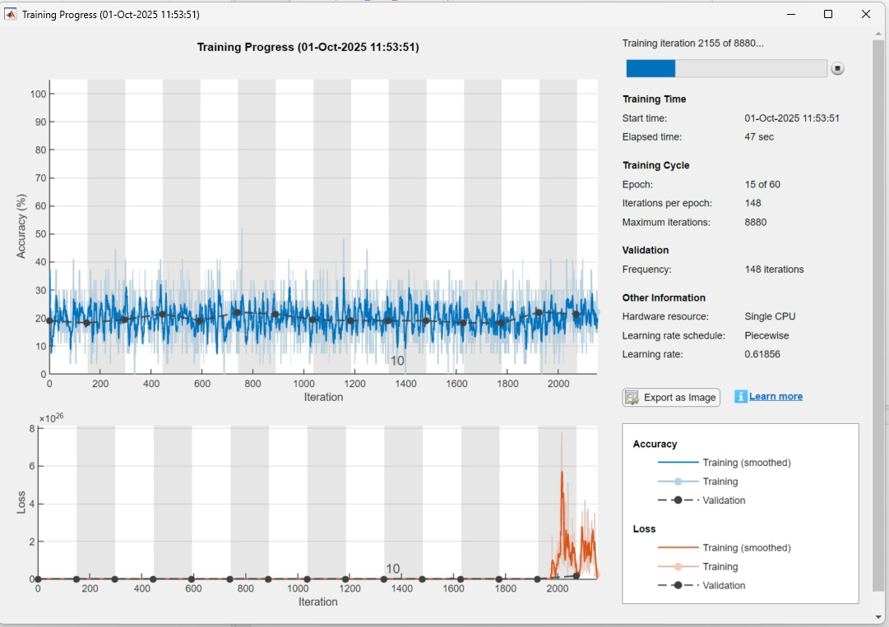

# DL-Classification-JournalSubmiss
This project contains Deep Learning trained models files used in the research work "Extended method for Statistical Signal Characterization using moments
and cumulants: Application to recognition of pattern alterations in pulse-like waveforms employing Artificial Neural Networks". 
- DataSets.
- Deep Learning training scripts.

## Google drive link

## Deep Learning Folders

There are two folders used in this project:

- `1_DeepLearning_256pt`
- `2_DeepLearning_1024pt` *(files hosted on Google Drive)*

Due to GitHub's file size limitations, the `2_DeepLearning_1024pt` folder (which contains 1024-sample signal data) must be downloaded separately from the following link:

[DeepLearning_1024pt](https://drive.google.com/drive/folders/1gT2sfkVI4qCQr5dfevvo9KJVfXgDVU6A?usp=sharing)

After downloading, place the contents into the corresponding `2_DeepLearning_1024pt` folder within the project directory.

## Datasets for Training Process

Folders named `<signal-type>_<snr-level>dB` contain raw data generated using the [Pulsed-LikeSignal-Generator](https://github.com/ghernanbustos/Pulsed-LikeSignal-Generator.git).  
These files are formatted with the script `DataBaseGen_RawSignal_<train or test>.m` and saved as `.mat` files within the same folder.

Each folder includes a single `.mat` dataset file corresponding to a specific signal type and SNR level.  
The final dataset size is either `5000×256` or `5000×1024`, consisting of 1000 signals per filter deformation — resulting in 5 labeled classes.


## Deep Learning Training script File:

Once train and test datasets are formated into 5000x256 or 5000x1024 are able to be included into respective DL folder.  

### How to Reproduce the Workflow

1. **Run `<signal-type>_1D_CNN_HPO.m`**  
   The script will load the imported datasets
   ```
   	load ('Sinc_25dB_Train.mat'); % 5000x1024

	load ('Sinc_25dB_Test.mat');  % 5000x1024
	load ('Sinc_20dB_Test.mat');  % 5000x1024
	load ('Sinc_15dB_Test.mat');  % 5000x1024
	load ('Sinc_10dB_Test.mat');  % 5000x1024
	load ('Target_LabelNumbered.mat');
   ```
   and executes bayes optimization training
   
   ```
	%------------------- HPO 1D-CNN -------------------------------------------

	optimVars = [
	    optimizableVariable('SectionDepth',[1 3],'Type','integer')
	    optimizableVariable('InitialLearnRate',[1e-2 1],'Transform','log')
	    optimizableVariable('Momentum',[0.8 0.98])
	    optimizableVariable('L2Regularization',[1e-10 1e-2],'Transform','log')];

	ObjFcn = makeObjFcn(XTrain,TTrain,XValidation,TValidation);

	% Calls bayesopt function
	BayesObject = bayesopt(ObjFcn,optimVars, ...
	    'MaxTime',14*60*60, ...
	    'IsObjectiveDeterministic',false, ...
	    'UseParallel',false);   
   ```

<figure>
  <p align="center">
  
  </p>
</figure>
<p align="center">
	Bayes Optimization Training process.
</p>

After training process, model parameters will be saved in `<signal-type>Workspace.mat` file.

## Measuring Algorithm Execution Time

To measure execution time, run the script `timeMeasure.m` where each processing time value represents the average of 100 algorithm executions.

## File Table List:

| Folder             				|              Description			      |
|-------------------------------------------------------|-----------------------------------------------------|
| `<signal-type>_<snr-level>dB`	|Raw data and script to format dataset|
| `Deep_Learning_<signal-type>`	| Script for traning and excecution time measurment|

| File             				|              Description			      |
|-------------------------------------------------------|-----------------------------------------------------|
| `<signal>_1D_CNN_HPO.m`						| Training network script     |
| `timeMeasure.m`				| algorithm excecution time measurement|	
| `<signal-type>_gauss1_25dB_testElement`                | raw signal element (signal amplitude and time) to test timeMeasure |

## Waveforms Samples to be classified:

The visualizations illustrate waveform distortions induced by Gaussian and low-pass filtering. 
These examples probe the classifier’s ability to resolve nuanced structural differences, 
emphasizing its discriminative sensitivity.

<figure>
  <p align="center">
  
  </p>
</figure>
<p align="center">
	Sinc Waveform at different SNR noise level and filter profile deformation.
</p>   
      
<figure>
  <p align="center">
  
  </p>
</figure>
<p align="center">
	Gauss Waveform at different SNR noise level and filter profile deformation.
</p>     

<figure>
  <p align="center">
  
  </p>
</figure>
<p align="center">
	Chirp Waveform at different SNR noise level and filter profile deformation.
</p>     


## Author

- Guillermo H. Bustos 	(ghbustos@famaf.unc.edu.ar) 
- Héctor H. Segnorile 	(hector.segnorile@unc.edu.ar)
- **Institution**: Instituto de Física Enrique Gaviola (IFEG CONICET)- Universidad Nacional de Córdoba - FAMAF


